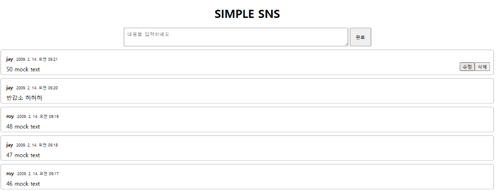
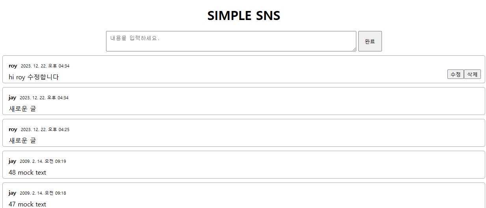

# REACT STUDY

참고 강의 : 풀스택 리액트 토이프로젝트 - REST, GraphQL (for FE개발자) <https://inf.run/taDu>

---

## 목차
1. [12월20일 연구노트](#12월20일-연구노트)
1. [12월21일 연구노트](#12월21일-연구노트)
1. [12월22일 연구노트](#12월22일-연구노트)

---

## 12월20일 연구노트

### 토이프로젝트(간단한 SNS 서비스)

- ```yarn init -y```  yarn workspace를 사용하기 위해 yarn 설치
  - 위 코드만 작성 시 오류가 발생해 ```corepack enable``` 입력 후 위 코드 작성하였음 ➡️ 오류 해결
- ```yarn add react react-dom next sass axios``` 패키지 설치
- 메시지 아이템 만들기
  - 유저아이디```{userid}```, 시간정보```{new Date(timstamp).toLocaleString()}```
- 임시데이터 만들기
  - ```id: i + 1``` 고유 아이디 
  - ```userId: getRandomUserId()``` 두명의 유저를 랜덤으로 가져옴
  - ```timestamp: 1234567890123 + (50 - i) * 1000 * 60``` 타임스탬프(1분에 하나씩 보여지도록) 
  - ```text: `${50 - i} mock text` ``` n번째 메세지 (50부터 거꾸로)
- 메시지 리스트를 표시하는 컴포넌트 만들기
  - ```{msgs.map(x => (``` msgs 배열을 순회하며
  - ```<MsgItem key={x.id}{...x}/>``` MsgItem컴포넌트로 렌더링하고 고유 키와 해당 속성이 전달
- 스타일 적용 후 출력
<p align="center"></p>

---

## 12월21일 연구노트

### 메세지 입력, 수정, 삭제 구현

- 입력 폼과 폼 제출 시 실행시킬 함수 ```onSubmit={onSubmit}```작성
- 함수 onSubmit에서 ```e.preventDefault()```와 ```e.stopPropagation()```으로 기본 이벤트 동작을 삭제
- ```const text = textRef.current.value```와 ```textRef.current.value=''``` 로 현재 값 할당 후 양식을 비움
- Create, Update, Delete
  - 메세지 생성 함수
    ```js
      const onCreate = text => { 
        const newMsg = {
          id: msgs.length + 1, /* +1 안하면 메시지 아이디 중복됨 */
          userId: getRandomUserId(),
          timestamp: Date.now(),
          text: `${msgs.lengh + 1} ${text}` /* 메세지 아이디와 사용자가  입력한 메시지 */
        } 
        setMsgs(msgs => [newMsg, ...msgs]) /* 기존 메세지 목록에 추가 */
      }
    ```
  - 메세지 수정 함수 
    ```js
      const onUpdate = (text, id) => {
        const newMsgs = [...msgs];
        newMsgs.splice(targetIndex, 1, {
          ...msgs[targetIndex],
          text,
        });
        return newMsgs; /* 메세지 수정 후 새로운 목록 반환 */
      }
    ```
  - 메세지 삭제 함수 
    ```js
      const onDelete = id => {
        const newMsgs = [...msgs];
        newMsgs.splice(targetIndex, 1); /* 메세지 삭제 */
        return newMsgs; /* 삭제 후의 메세지 목록 반환 */
      }
    ```
<p align="center"></p>

---

## 12월22일 연구노트

### DB & 서버 생성

- 지난 번에 임의로 생성해둔 데이터를 ```{"id":50"text":"50 mock text","userId":"jay","timestamp":1234570890123}```과 같은 형식으로 콘솔에 출력 시키고 .json에 넣어 DB 만들기
- DB read & write
  - DB읽어오기
    ```js
      export const readDB = target => { 
        return JSON.parse(fs.readFileSync(filenames[target], 'utf-8')) 
      }
    ```
  - 작성한 메세지 DB에 넣기
    ```js
      export const writeDB = (target, data) => { /* data는 덮어씌울 데이터 */
        return fs.writeFileSync(filenames[target], JSON.stringify(data))
      }
    ```
- 서버에서 메세지를 읽어올지 삽입할지 선택하기 위해 ```import {readDB, writeDB} from "../dbController.js"```, ```readDB('messages')```, ```writeDB('messages', data)```
- 수정시 ```const newMsg = {...msgs[targetIndex], text: body.text}```로 새로운 메세지로 바꾸고, ```writeDB('messages', data)``` DB에 저장
- 부가설정
  - 유저아이디가 없을 때 메세지 작성시 경고문 ```if (!body.userId) throw Error('no userId')```
    - ```{userId && <MsgInput mutate={onCreate} />}``` 유저아이디가 있을 때만 입력창이 뜨도록 설정
  - ```const targetIndex = msgs.findIndex(msg => msg.id === id)``` 메세지 수정할 때 기존 유저와 수정한 유저가 같으면
    - 접속한 유저 아이디로 메세지 등록 ```const {query: {userId}} = useRouter()```
  - ```myId={userId}```, ```myId == userId``` 접속한 유저는 자신이 등록한 메세지만 수정/삭제할 수 있도록 함
- 오류 발생
  - ```localhost:3000/?userId=roy``` 로 접속했을 때 ```userid```로 바뀌는 오류
    - ```userid```일 때와 ```userId```일 때 모두 대응할 수 있도록 ```const userId = query.userId || query.userid || ''```
  - ```localhost:8000/messages/50```으로 접속했을 때 50번의 메세지가 보이지 않는 오류 발생
    - ```"id"=50```이라고 저장되어 있는데 문자열을 찾고 있기 때문에 ```"id"="50"```이라고 수정하여 해결
<p align="center"></p>
