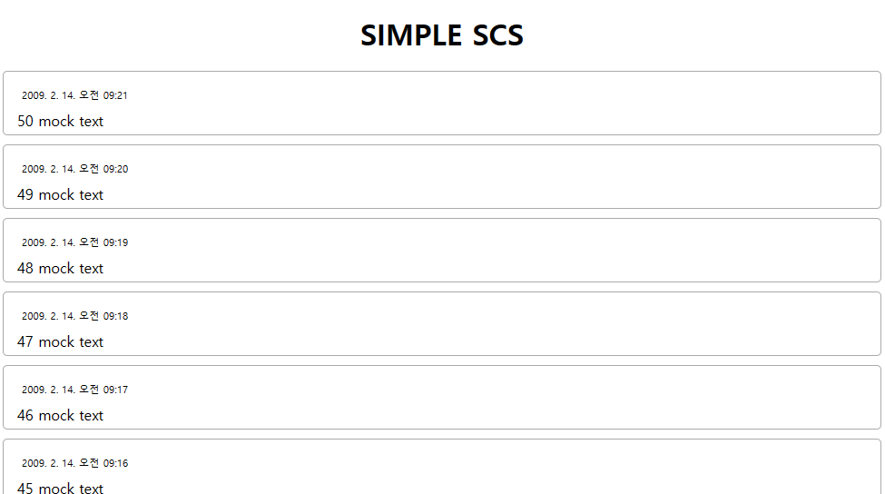

# REACT STUDY

참고 강의 : 풀스택 리액트 토이프로젝트 - REST, GraphQL (for FE개발자) <https://inf.run/taDu>

---

### 목차
1. [12월20일 연구노트](#12월20일-연구노트)

---

### 12월20일 연구노트
- 토이프로젝트(간단한 SNS 서비스)를 제작하기로 함
  - ```yarn init -y```  yarn workspace를 사용하기 위해 yarn 설치
    - 위 코드만 작성 시 오류가 발생해 ```corepack enable``` 입력 후 위 코드 작성하였음 ➡️ 오류 해결
  - ```yarn add react react-dom next sass axios``` 패키지 설치
  - 메시지 아이템 만들기
    - 유저아이디```{userid}```, 시간정보```{new Date(timstamp).toLocaleString()}```
  - 임시데이터 만들기
    - ```id: i + 1``` 고유 아이디 
    - ```userId: getRandomUserId()``` 두명의 유저를 랜덤으로 가져옴
    - ```timestamp: 1234567890123 + (50 - i) * 1000 * 60``` 타임스탬프(1분에 하나씩 보여지도록) 
    - ```text: `${50 - i} mock text` ``` n번째 메세지 (50부터 거꾸로)
  - 메시지 리스트를 표시하는 컴포넌트 만들기
    - ```{msgs.map(x => (``` msgs 배열을 순회하며
    - ```<MsgItem key={x.id}{...x}/>``` MsgItem컴포넌트로 렌더링하고 고유 키와 해당 속성이 전달
  - 스타일 적용 후 출력
<center></center>
